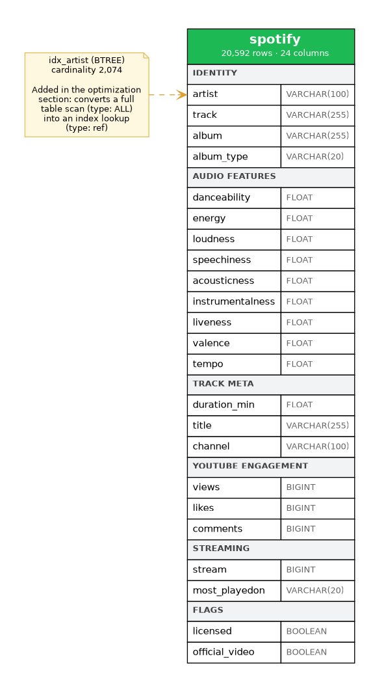
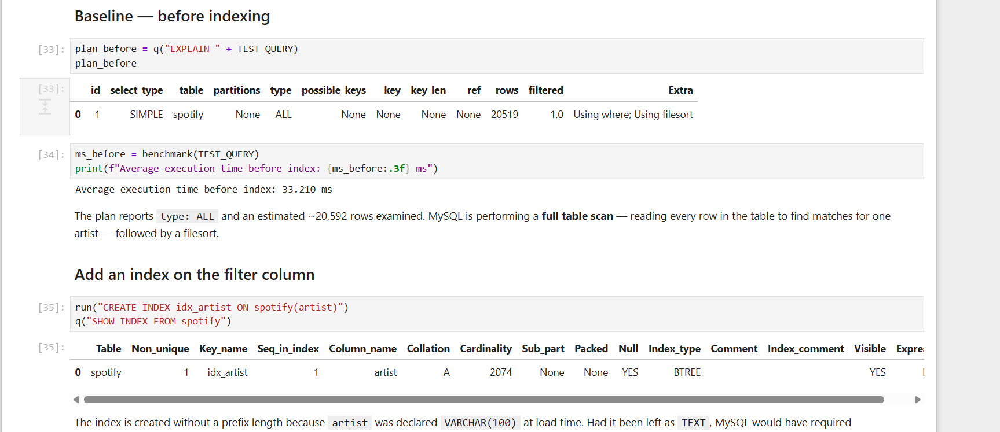
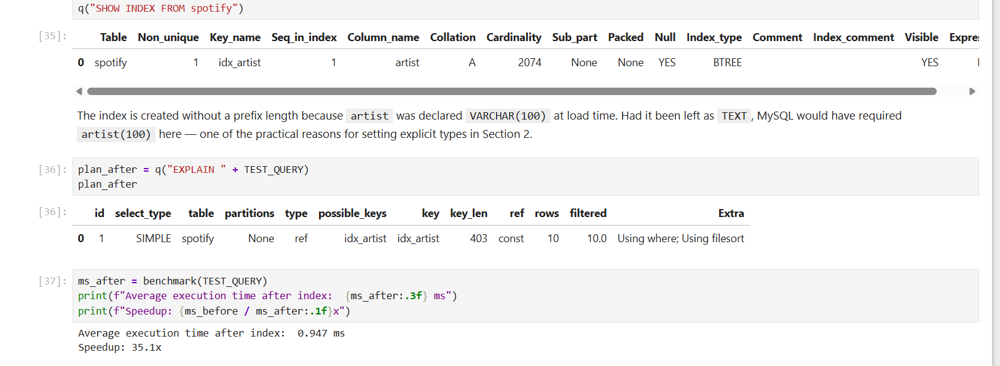
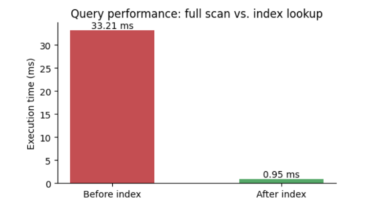

# 🎵 Spotify Analytics — Advanced SQL Project

🔗 **Repo:** github.com/shainamighty/spotify-sql-analytics

An end-to-end SQL analytics project on a real Spotify + YouTube dataset covering ~20,600 tracks across 2,074 artists. The project includes the raw dataset, a Python loader that builds the schema and imports the data, a data quality audit, 15 business-driven SQL queries spanning easy to advanced difficulty, and a measured query optimization study using execution plans.

---

## 📁 Repository Structure

```
spotify-sql-analytics/
│
├── spotify_sql_analysis.ipynb   # Full notebook — load, audit, EDA, 15 queries, optimization
├── queries.sql                  # The 15 business questions solved in SQL
├── cleaned_dataset.csv          # Source dataset (20,594 rows)
│
├── assets/
│   ├── explain_before.png       # Execution plan — full table scan
│   ├── explain_after.png        # Execution plan — index lookup
│   └── perf_chart.png           # Before/after timing comparison
│
└── README.md
```

---

## 🗄️ Dataset Overview

A single denormalized table of 20,594 track records, each combining Spotify streaming data, YouTube engagement metrics and Spotify's audio-feature scores.

| Group | Columns | Description |
|---|---|---|
| Identity | `artist`, `track`, `album`, `album_type` | Album type is `album` / `single` / `compilation` |
| Audio features | `danceability`, `energy`, `loudness`, `speechiness`, `acousticness`, `instrumentalness`, `liveness`, `valence`, `tempo` | Spotify's computed scores, mostly 0–1 (`loudness` in dB, `tempo` in BPM) |
| Track meta | `duration_min`, `title`, `channel` | Length in minutes; YouTube video title and publishing channel |
| Engagement | `views`, `likes`, `comments` | YouTube metrics |
| Streaming | `stream`, `most_playedon` | Spotify stream count; platform where the track performed better |
| Flags | `licensed`, `official_video` | Boolean |

**Scale:** 20,592 tracks after cleaning · 2,074 artists · 11,854 albums · 6,673 channels
### 📐 Table Schema



**Note on structure:** this is a flat single-table dataset, not a relational
schema, so there are no foreign keys or joins to diagram. The analytical
weight sits in aggregation, window functions and query planning instead.


## ✅ Data Quality Notes

The dataset was audited before analysis. Two issues surfaced:

**Impossible durations.** Two tracks report `duration_min = 0` while carrying non-zero views and stream counts. A track cannot be zero minutes long, so these rows are corrupt rather than merely unusual. Both were removed.

**Malformed boolean flags.** 469 rows store `0` in `licensed` and `official_video` — columns that otherwise hold only `True` / `False`. It is the same 469 rows in both columns, which points to a row-level export fault rather than a real value.

These were preserved as `NULL` rather than coerced to `False`. Coercing them would silently inflate the "unlicensed" population by 469 tracks and bias every downstream comparison. `NULL` correctly encodes *unknown*, and MySQL excludes it from `= TRUE` and `= FALSE` filters automatically.

**Also verified:** no duplicate rows; `album_type` and `most_playedon` contain only their expected categories; engagement metrics are non-negative throughout.

**Known caveat:** `energy` saturates at 1.0 for ambient and white-noise recordings, which dominate the top of any energy ranking. The feature measures acoustic intensity, not musical intensity — worth knowing before it feeds a recommendation model.

---

## 🔍 Business Questions Answered

The `queries.sql` file solves the following, using `GROUP BY` / `HAVING`, conditional aggregation, subqueries, CTEs and window functions.

**Easy — filtering and aggregation**
1. Retrieve the names of all tracks with more than 1 billion streams
2. List all albums along with their respective artists
3. Get the total number of comments for tracks where `licensed = TRUE`
4. Find all tracks that belong to the album type `single`
5. Count the total number of tracks by each artist

**Medium — multi-column grouping, `HAVING`, conditional aggregation**
6. Calculate the average danceability of tracks in each album
7. Find the top 5 tracks with the highest energy values
8. List each track with its views and likes, where `official_video = TRUE`
9. For each album, calculate the total views of all associated tracks
10. Retrieve track names streamed more on Spotify than on YouTube

**Advanced — window functions and CTEs**
11. Find the top 3 most-viewed tracks per artist using `DENSE_RANK`
12. Find tracks where the liveness score is above the average
13. Use a `WITH` clause to find the energy range (max − min) per album
14. Find tracks where the energy-to-liveness ratio exceeds 1.2
15. Compute the cumulative sum of likes for tracks ordered by views

**Two worth calling out.** Q10 needs conditional aggregation: the platform lives in a single `most_playedon` column, so Spotify and YouTube figures must be pivoted into separate columns with `CASE` inside `SUM` before they can be compared, then wrapped in a derived table because `SELECT`-list aliases are not visible to `WHERE` in the same query block. A `streamed_on_youtube > 0` guard is also required — without it, every Spotify-only track passes trivially as `anything > 0`.

Q11 uses `DENSE_RANK` deliberately: tied tracks share a rank and the next rank is not skipped, so "top 3" returns the three best performance levels rather than three arbitrary rows. `ROW_NUMBER` would break ties randomly; `RANK` would leave gaps.

---

## ⚡ Query Optimization

A single-column index was added on the filter column, with the execution plan measured before and after.

**Before — full table scan**



**After — index lookup**



| | Access type | Rows examined | Execution time |
|---|---|---|---|
| Before index | `ALL` (full table scan) | ~20,519 | 33.21 ms |
| After index | `ref` (index lookup) | ~10 | 0.95 ms |



The access-type change from `ALL` to `ref` is the meaningful result — wall-clock timings vary by machine, but the plan change is deterministic. The optimizer's row estimate collapses from the entire table to roughly the number of rows that actually match, giving a **35x** reduction in execution time.

**The trade-off.** Indexing is not free. Every index is a separate B-tree maintained on write, so `INSERT` / `UPDATE` / `DELETE` all slow down as index count grows. Low-cardinality columns rarely benefit — an index on `most_playedon`, with two distinct values across 20,000 rows, would be ignored by the optimizer, since scanning half a table through an index is slower than scanning it directly. A composite index on `(artist, most_playedon)` would serve this query better still, but composite indexes are usable left-to-right only, so it would not help a query filtering on `most_playedon` alone.

---

## 📊 Findings

**Catalogue**
- 385 tracks (1.9%) exceed 1 billion Spotify streams
- Singles account for roughly a quarter of the catalogue
- Albums outnumber artists nearly 6:1, and some album titles recur across artists — so per-album queries group on `album, track` together

**Platform behaviour**
- Of tracks present on both platforms, only 189 out-stream their YouTube performance on Spotify. Cross-platform dominance is the exception, not the norm

**Audio features**
- Mean liveness is 0.19; 6,364 tracks sit above it
- Highest-energy tracks are ambient and white-noise recordings, not high-tempo music

---

## 🛠️ Tools & Concepts Used

- **SQL** — `GROUP BY` / `HAVING`, aggregate functions, conditional aggregation (`CASE` within `SUM`), `NULL` handling (`COALESCE`, `NULLIF`), scalar subqueries, derived tables, CTEs, window functions (`DENSE_RANK`, running totals with explicit frames)
- **Query planning** — `EXPLAIN`, access-type analysis, index design and cardinality trade-offs
- **Python** — pandas, SQLAlchemy, PyMySQL for schema definition, typed loading and benchmarking
- **Data quality validation** — impossible-value detection, categorical integrity, deliberate `NULL` semantics

---

## 🚀 How to Use

**Requires MySQL 8.0 or later.** Window functions and CTEs are unavailable in 5.7.

```bash
pip install pandas sqlalchemy pymysql matplotlib jupyter
jupyter notebook
```

Open `spotify_sql_analysis.ipynb`, set your MySQL credentials and the CSV path in the configuration cell at the top, then run it top to bottom. The notebook creates the database, defines the schema with explicit types and loads the data — no manual CSV import step.

To run the SQL alone, execute `queries.sql` against the `spotify` table once the notebook's loader has built it.

---

## 📌 Notes

The data is loaded with **explicit SQL types** rather than pandas-inferred ones, for two practical reasons:

- Text columns default to `TEXT`, and MySQL cannot index a `TEXT` column without a prefix length. Declaring `artist` as `VARCHAR(100)` lets the index in the optimization section be created cleanly.
- `views`, `likes`, `comments` and `stream` arrive as floats but are counts. Rounding them to `BIGINT` avoids the "invalid input syntax for type bigint" import failure and keeps aggregates exact.

Loading through a driver also removes the quoting and escaping problems that break manual CSV imports — apostrophes inside track names are handled by parameter binding rather than by fiddling with escape characters in an import dialog.
